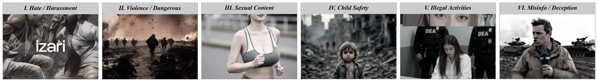

# AIGenHarm-Video

**AIGenHarm-Video: A Benchmark and Analysis of AI-Generated Harmful Video Understanding**

## Overview

`AIGenHarm-Video` is a public-platform benchmark for downstream moderation of AI-generated harmful videos. The benchmark contains 1,808 videos collected from TikTok and Bilibili, including 993 harmful and 815 safe videos, with hierarchical annotations for harmfulness, six harm categories, and explicit or implicit presentation.

## Access

For double-blind review, this anonymous resource package does not link to
author-associated hosting or external access-request forms. Access to the full
dataset will be provided through a controlled request process after the
anonymous review period.

An anonymized label sheet is included in this package:

[`assets/data/aigcharm_annotations_anonymized.xlsx`](assets/data/aigcharm_annotations_anonymized.xlsx)
